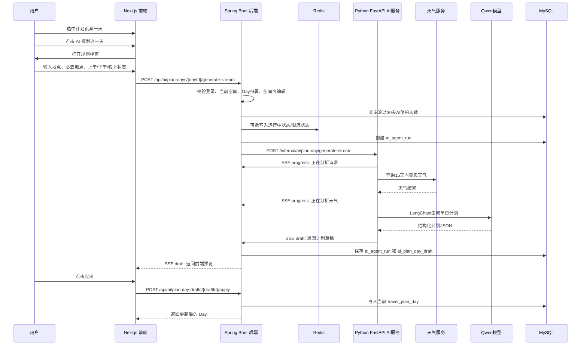

# AI 旅行规划 Agent v1 技术方案

## 1. 方案定位

本方案用于定义“AI 单日旅行计划 Agent v1”的功能流程、数据表、接口契约和 Python 服务结构。当前阶段只做技术方案，不直接编写前端、后端、数据库迁移或 Python 业务代码。

v1 的核心目标是：用户在计划页选中某一天后，让 AI 根据用户想去的地点、必去地点、当天上午/下午/晚上的出行状态和天气情况，生成当前 Day 的旅行计划草稿。AI 只生成建议，必须由用户确认后才保存到计划页。

## 2. v1 功能范围

已确认的 v1 范围：

1. 用户先在计划页选中某一天，再点击“AI 规划这一天”。
2. AI 不一次性生成多天计划，只规划当前选中的 Day。
3. 用户输入想去的地点列表。
4. 用户从已输入地点中选择必去地点。
5. 用户分别设置上午、下午、晚上是“出去玩”还是“酒店休息”。
6. 计划日期距当前日期 15 天以内时，使用真实天气预报。
7. 计划日期距当前日期超过 15 天时，不查真实天气，提示天气可能不稳定。
8. 地点相近判断 v1 先由 AI 根据常识完成，不接地图 API。
9. 采用 SSE 流式输出生成进度。
10. AI 生成的是计划草稿，用户点击确认后才保存到当前 Day。
11. 普通用户滚动 30 天内可使用 3 次 AI 旅行计划。
12. VIP 用户滚动 30 天内可使用 10 次 AI 旅行计划。
13. Python 服务 v1 先用 LangChain。
14. LangGraph、RAG、Milvus 作为后续升级方向，v1 只预留结构，不正式接入。

不在 v1 范围内：

1. 不接地图 API 计算真实经纬度、距离和通勤时间。
2. 不接机票、酒店、门票接口。
3. 不做多天一键规划。
4. 不做 Milvus 向量检索。
5. 不让 AI 直接写数据库。
6. 不让前端直接调用 Python AI 服务。

## 3. 用户功能流程



## 4. 前端交互设计

入口位置：计划页当前 Day 编辑区域中，放置“AI 规划这一天”按钮。

触发前提：

1. 用户已登录。
2. 当前空间可编辑。
3. 当前已选中一个 Day。
4. 用户未超过滚动 30 天额度。

弹窗字段：

```text
目的地城市：青岛

想去的地方：
- 小麦岛
- 八大关
- 栈桥
- 五四广场

必去地点：
- 从“想去的地方”中勾选，例如小麦岛、八大关

上午：
- 出去玩
- 酒店休息

下午：
- 出去玩
- 酒店休息

晚上：
- 出去玩
- 酒店休息

备注：
- 不想太累，想拍照，晚上想看海
```

流式生成时的前端提示示例：

```text
正在读取当天安排...
正在检查你的 AI 使用次数...
正在查询天气...
正在分析哪些地点适合一起游玩...
正在安排上午...
正在安排下午...
正在安排晚上...
计划已生成，请确认是否应用到这一天
```

用户操作语义：

1. 点击“生成”：消耗一次 AI 计划额度。
2. 点击“应用到计划页”：把草稿写入当前 Day。
3. 点击“取消”：不写入当前 Day，草稿标记为取消或保持未应用。
4. 点击“重新生成”：再次消耗一次额度，生成新的草稿。

## 5. 天气规则

天气能力是 v1 的重要 Tool。

规则：

1. 如果当前 Day 的日期距今天不超过 15 天，调用真实天气预报。
2. 如果当前 Day 的日期距今天超过 15 天，不调用真实天气预报。
3. 超过 15 天时，AI 只按季节和常识给出建议，并提示天气可能变化。

超过 15 天的提示文案：

```text
当前计划日期距离今天超过 15 天，天气预报可能不稳定。AI 会先按季节和常规天气给出建议，出行前请再确认实时天气。
```

天气 Tool 输入：

```json
{
  "city": "青岛",
  "date": "2026-07-01"
}
```

天气 Tool 输出：

```json
{
  "available": true,
  "city": "青岛",
  "date": "2026-07-01",
  "weather": "多云",
  "temperatureMin": 22,
  "temperatureMax": 28,
  "rainProbability": "低",
  "wind": "3级",
  "outdoorSuitability": "GOOD",
  "tips": ["适合海边散步和拍照"]
}
```

超过 15 天时输出：

```json
{
  "available": false,
  "reason": "OUT_OF_FORECAST_RANGE",
  "tips": ["计划日期较远，天气可能变化，出行前请重新确认天气。"]
}
```

## 6. 地点相近判断

v1 不接地图 API，不做真实经纬度计算。

v1 做法：

1. 用户输入地点列表。
2. AI 根据常识判断哪些地点适合放在同一时段。
3. AI 在结果中说明原因。

示例：

```text
八大关和第二海水浴场距离较近，可以安排在同一时段。
五四广场和奥帆中心适合晚上一起游玩。
小麦岛建议单独留出较完整的一段时间。
```

后续升级方向：

1. 接高德地图、百度地图或腾讯地图地点搜索 API。
2. 通过地点名获取经纬度。
3. 计算两地距离和通勤时间。
4. 把真实距离作为 Agent Tool 输出给模型。

## 7. 权限与安全规则

1. 前端不传 `userId`。
2. Java 后端通过 HttpOnly Cookie 获取当前用户。
3. Java 后端根据当前用户获取当前空间。
4. 当前 Day 必须属于当前空间。
5. AI 计划只能作用于当前空间。
6. 个人空间可以使用 AI 单日计划。
7. 情侣空间未邀请对方进入并创建成功前，不能进入，也不能使用 AI 计划。
8. AI 生成内容必须由用户确认后才能写入 `travel_plan_day`。
9. DashScope、天气服务、地图服务等密钥只允许放在服务端环境变量。
10. 前端不保存任何云服务 AccessKey。
11. 后端必须记录 AI 调用次数，防止成本失控。
12. AI 输入输出中不记录密码、Cookie、AccessKey 等敏感信息。

## 8. 额度规则

采用滚动 30 天额度。

```text
普通用户：滚动 30 天内 3 次 AI 旅行计划
VIP 用户：滚动 30 天内 10 次 AI 旅行计划
```

建议以 MySQL `ai_agent_run` 作为最终判断依据：

```sql
SELECT COUNT(*)
FROM ai_agent_run
WHERE user_id = ?
  AND agent_type = 'TRAVEL_DAY_PLAN'
  AND status IN ('SUCCESS', 'APPLIED')
  AND deleted = 0
  AND created_at >= DATE_SUB(NOW(), INTERVAL 30 DAY);
```

Redis 可用于缓存或短期限流，但不能作为唯一额度依据。

## 9. 数据表设计

### 9.1 ai_agent_run

用于记录每一次 AI Agent 运行，是 Agent Harness 的核心审计表。

```sql
CREATE TABLE ai_agent_run (
  id BIGINT PRIMARY KEY AUTO_INCREMENT,
  run_id VARCHAR(64) NOT NULL,
  space_id BIGINT NOT NULL,
  user_id BIGINT NOT NULL,
  agent_type VARCHAR(32) NOT NULL,
  model_name VARCHAR(64) NOT NULL,
  prompt_version VARCHAR(64) NOT NULL,
  input_json LONGTEXT NOT NULL,
  output_json LONGTEXT NULL,
  status VARCHAR(32) NOT NULL,
  error_message VARCHAR(1000) NULL,
  token_input INT NOT NULL DEFAULT 0,
  token_output INT NOT NULL DEFAULT 0,
  duration_ms INT NOT NULL DEFAULT 0,
  accepted TINYINT NOT NULL DEFAULT 0,
  created_at DATETIME NOT NULL,
  updated_at DATETIME NOT NULL,
  deleted TINYINT NOT NULL DEFAULT 0,
  UNIQUE KEY uk_ai_agent_run_run_id (run_id),
  KEY idx_ai_agent_run_space_created (space_id, created_at),
  KEY idx_ai_agent_run_user_created (user_id, created_at)
);
```

状态说明：

```text
CREATED：已创建运行记录
RUNNING：正在生成
SUCCESS：生成成功但未应用
FAILED：生成失败
APPLIED：用户已应用
DISCARDED：用户取消或丢弃
```

### 9.2 ai_agent_event

用于记录 Agent 每一步进度和工具调用，方便排查问题和面试展示。

```sql
CREATE TABLE ai_agent_event (
  id BIGINT PRIMARY KEY AUTO_INCREMENT,
  run_id VARCHAR(64) NOT NULL,
  event_type VARCHAR(32) NOT NULL,
  event_message VARCHAR(500) NOT NULL,
  event_json LONGTEXT NULL,
  created_at DATETIME NOT NULL,
  KEY idx_ai_agent_event_run_id (run_id)
);
```

事件类型示例：

```text
START
QUOTA_CHECK
WEATHER
PLACE_GROUPING
LLM
DRAFT
ERROR
```

### 9.3 ai_plan_day_draft

用于保存 AI 生成的当前 Day 草稿。

```sql
CREATE TABLE ai_plan_day_draft (
  id BIGINT PRIMARY KEY AUTO_INCREMENT,
  run_id VARCHAR(64) NOT NULL,
  space_id BIGINT NOT NULL,
  user_id BIGINT NOT NULL,
  plan_day_id BIGINT NOT NULL,
  title VARCHAR(100) NOT NULL,
  morning_json LONGTEXT NULL,
  afternoon_json LONGTEXT NULL,
  evening_json LONGTEXT NULL,
  tips_json LONGTEXT NULL,
  status VARCHAR(32) NOT NULL,
  applied_at DATETIME NULL,
  created_at DATETIME NOT NULL,
  updated_at DATETIME NOT NULL,
  deleted TINYINT NOT NULL DEFAULT 0,
  KEY idx_ai_plan_day_draft_run_id (run_id),
  KEY idx_ai_plan_day_draft_day_created (plan_day_id, created_at)
);
```

状态说明：

```text
DRAFT：已生成，等待用户确认
APPLIED：已应用到计划页
DISCARDED：用户取消或丢弃
```

### 9.4 travel_plan_day 写入方式

v1 不改 `travel_plan_day` 表结构。用户应用 AI 草稿时，将 AI 结果合并写入当前 Day：

```text
title：AI 生成的当天标题
detail：上午、下午、晚上、提醒合并后的文本
```

`detail` 示例：

```text
上午：八大关适合早上散步和拍照，光线柔和，人也相对少。

下午：去小麦岛看海，建议留出完整时间慢慢逛。

晚上：回酒店休息，避免一天行程太累。

提醒：计划日期较远，天气可能变化，出行前请再确认实时天气。
```

## 10. 前端到 Java 接口契约

### 10.1 流式生成当前 Day 计划

```http
POST /api/ai/plan-days/{dayId}/generate-stream
Content-Type: application/json
Accept: text/event-stream
```

请求：

```json
{
  "destination": "青岛",
  "places": ["小麦岛", "八大关", "栈桥", "五四广场"],
  "mustVisitPlaces": ["小麦岛", "八大关"],
  "morningMode": "PLAY",
  "afternoonMode": "PLAY",
  "eveningMode": "REST",
  "notes": "不想太累，想拍照"
}
```

字段说明：

```text
destination：目的地城市
places：用户想去的地点
mustVisitPlaces：必去地点，只能来自 places
morningMode：PLAY 或 REST
afternoonMode：PLAY 或 REST
eveningMode：PLAY 或 REST
notes：用户补充偏好
```

SSE 事件：

```text
event: progress
data: 正在检查 AI 使用次数

event: progress
data: 正在查询天气

event: progress
data: 正在分析地点是否适合一起游玩

event: draft
data: {"runId":"ai_run_xxx","draftId":1,"dayId":12,"title":"青岛海边轻松拍照一日","morning":{},"afternoon":{},"evening":{},"tips":[]}

event: error
data: {"message":"今天的 AI 规划次数已用完"}
```

### 10.2 应用草稿到当前 Day

```http
POST /api/ai/plan-day-drafts/{draftId}/apply
```

返回：

```json
{
  "success": true,
  "day": {
    "id": 12,
    "date": "2026-07-01",
    "title": "青岛海边轻松拍照一日",
    "detail": "上午：...\n\n下午：...\n\n晚上：..."
  }
}
```

### 10.3 丢弃草稿

```http
POST /api/ai/plan-day-drafts/{draftId}/discard
```

返回：

```json
{
  "success": true
}
```

## 11. Java 到 Python 内部接口契约

### 11.1 流式生成当前 Day 计划

```http
POST /internal/ai/plan-day/generate-stream
Content-Type: application/json
Accept: text/event-stream
```

请求：

```json
{
  "requestId": "ai_run_20260623_xxx",
  "spaceId": 1,
  "userId": 1,
  "planDayId": 12,
  "modelName": "qwen-plus",
  "promptVersion": "travel_day_plan_v1",
  "destination": "青岛",
  "planDate": "2026-07-01",
  "places": ["小麦岛", "八大关", "栈桥", "五四广场"],
  "mustVisitPlaces": ["小麦岛", "八大关"],
  "morningMode": "PLAY",
  "afternoonMode": "PLAY",
  "eveningMode": "REST",
  "notes": "不想太累，想拍照",
  "weather": {
    "available": true,
    "weather": "多云",
    "temperatureMin": 22,
    "temperatureMax": 28,
    "rainProbability": "低",
    "tips": ["适合海边散步和拍照"]
  }
}
```

Python SSE 事件：

```text
event: progress
data: {"step":"START","message":"正在分析当天安排"}

event: progress
data: {"step":"PLACE_GROUPING","message":"正在判断哪些地点适合一起游玩"}

event: draft
data: {"requestId":"ai_run_20260623_xxx","success":true,"modelName":"qwen-plus","title":"青岛海边轻松拍照一日","morning":{},"afternoon":{},"evening":{},"tips":[],"tokenInput":0,"tokenOutput":0}
```

## 12. Python AI 服务结构

建议结构：

```text
apps/ai-service/
  app/
    main.py
    api/
      ai.py
      plan_day.py
    schemas/
      plan_day.py
    services/
      plan_day_agent_service.py
      model_client.py
      prompt_templates.py
      weather_tool.py
      place_grouping_tool.py
    core/
      config.py
      errors.py
```

职责说明：

```text
api/plan_day.py
  FastAPI 路由层，负责接收 Java 内部请求并返回 SSE。

schemas/plan_day.py
  Pydantic 请求、响应、时段计划、天气结果结构。

services/plan_day_agent_service.py
  AI 单日计划主流程，组织天气、地点分析、模型生成。

services/model_client.py
  封装 DashScope / Qwen / LangChain 调用。

services/prompt_templates.py
  保存 prompt 模板和 prompt_version。

services/weather_tool.py
  天气查询工具。15 天以内查真实天气，超过 15 天返回不稳定提示。

services/place_grouping_tool.py
  地点相近判断工具。v1 使用 AI 常识，后续可替换为地图 API。

core/config.py
  读取环境变量。

core/errors.py
  统一 AI 错误和外部服务错误。
```

## 13. LangChain、LangGraph、RAG 知识点

### 13.1 v1 会用到的 LangChain 知识

```text
PromptTemplate：
把目的地、日期、天气、地点、必去地点、上午/下午/晚上状态组合成提示词。

Structured Output：
要求模型返回固定 JSON，方便前端展示和后端保存。

Tool Calling / Tool Abstraction：
把天气查询、地点组合判断包装成工具。

Output Parser：
校验模型返回内容是否符合计划结构。

Model Wrapper：
封装 Qwen / DashScope 调用，后续换模型时减少业务代码改动。
```

### 13.2 v1 暂不正式使用 LangGraph

v1 先用 LangChain 实现稳定链路。后续 v1.1 可以用 LangGraph 把 Agent 流程拆成节点：

```text
START
-> CHECK_INPUT
-> WEATHER_TOOL
-> PLACE_GROUPING_TOOL
-> GENERATE_PLAN
-> VALIDATE_OUTPUT
-> END
```

LangGraph 的价值：

1. 让 Agent 流程更清晰。
2. 方便失败重试。
3. 方便观察每个节点的输入输出。
4. 更适合企业级 AI 流程编排。

### 13.3 v1 暂不做 RAG

RAG 后续用于让 AI 参考用户自己的历史旅行记录。

未来流程：

```text
用户历史日记、计划、城市记录
-> 文本切分
-> 向量化 embedding
-> 存入 Milvus
-> 生成计划前检索相关记忆
-> AI 生成更符合用户习惯的计划
```

示例效果：

```text
AI 可以根据历史记录发现：
你们以前更喜欢轻松拍照、不喜欢赶路，所以这次计划不会安排太满。
```

## 14. 环境变量规划

Python AI 服务：

```text
ALIYUN_DASHSCOPE_API_KEY=
QWEN_MODEL_NAME=qwen-plus
WEATHER_API_KEY=
WEATHER_PROVIDER=
```

Java 后端：

```text
AI_SERVICE_BASE_URL=http://localhost:8000
AI_PLAN_FREE_LIMIT_30_DAYS=3
AI_PLAN_VIP_LIMIT_30_DAYS=10
```

## 15. 后续开发顺序建议

根据项目规则，后续开发不直接跳到接口实现，建议按以下顺序：

1. 确认前端弹窗和流式展示交互。
2. 根据前端交互确认接口契约。
3. 创建数据库迁移脚本。
4. 开发 Java AI 计划接口、额度校验、草稿保存。
5. 开发 Python LangChain 单日计划 Agent。
6. 前后端联调 SSE。
7. 测试普通用户和 VIP 用户滚动 30 天额度。
8. 测试 15 天以内真实天气和 15 天以后天气不稳定提示。
9. 测试用户取消、应用、重新生成的状态变化。

## 16. 待确认事项

进入开发前仍需确认：

1. 天气服务具体选择哪一家。
2. VIP 字段当前是否已有，还是先在用户表加 `vip` 标记。
3. SSE 是否由 Java 转发 Python 流，还是 Java 先调用 Python 后自己流式包装。
4. AI 草稿应用到 `travel_plan_day.detail` 的具体文本格式。
5. 前端弹窗最终 UI 和移动端布局。
